# Домашнее задание к занятию «Репликация и масштабирование. Часть 1» Бетко Алексей

### Задание 1

На лекции рассматривались режимы репликации master-slave, master-master, опишите их различия.

### Ответ
репликация master-slave подразумевает копирование данных только с master на slave, обрабно репликация данных не выполняется и из за этого слейв обычно делают только режиме чтения (read only).
репликация master-master это по сути схема репликации master-slave только в обе стороны, где каждый сервер одновременно и master и slave

---

### Задание 2

Выполните конфигурацию master-slave репликации, примером можно пользоваться из лекции.

*Приложите скриншоты конфигурации, выполнения работы: состояния и режимы работы серверов.*

### Ответ
#### Настройки
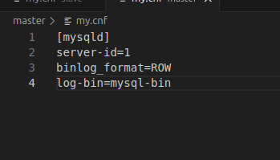
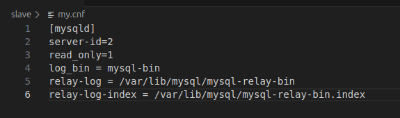
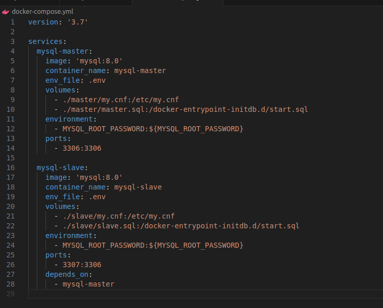
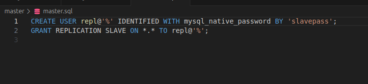
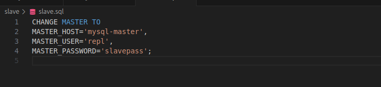

#### Состояния и режимы работы
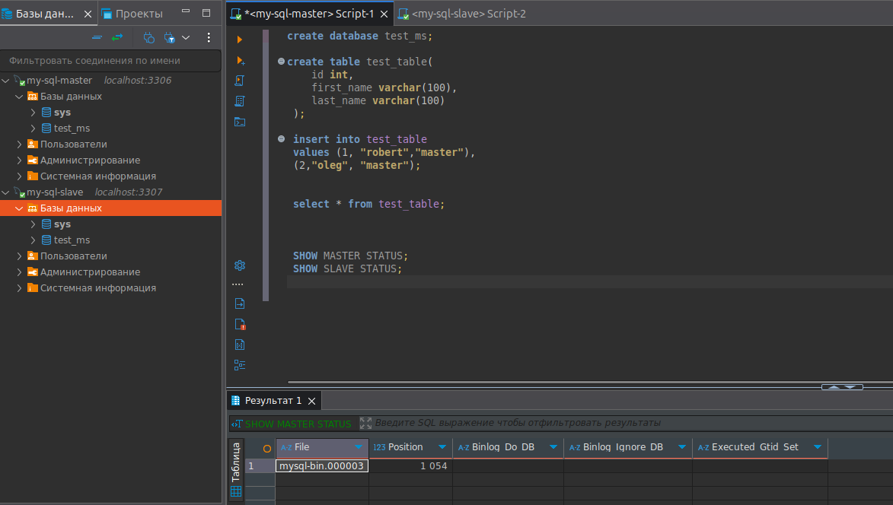
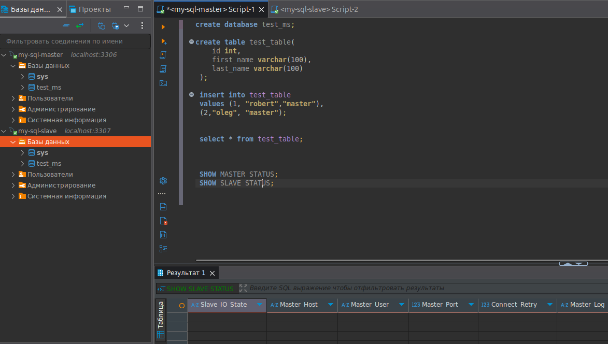
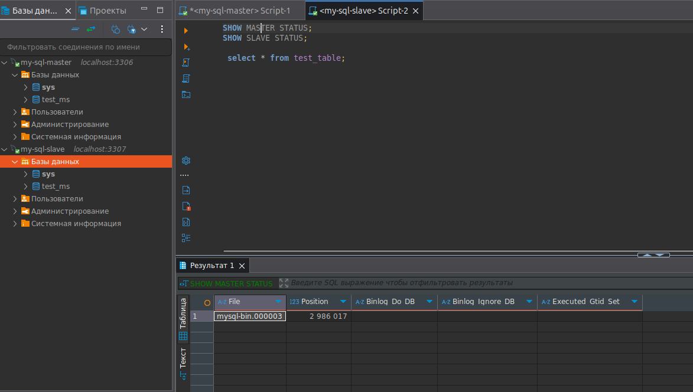
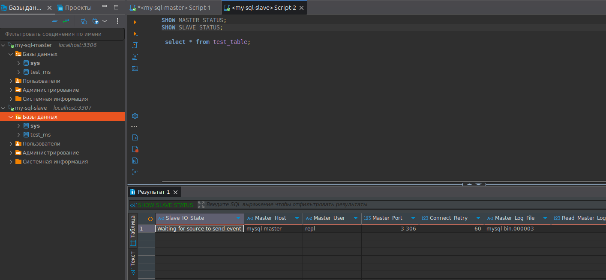
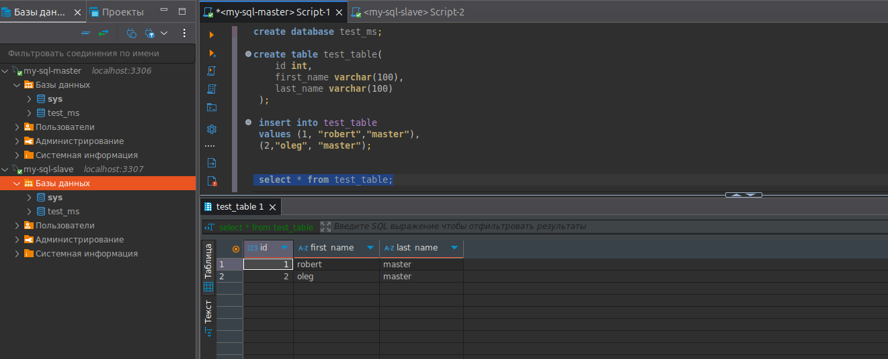
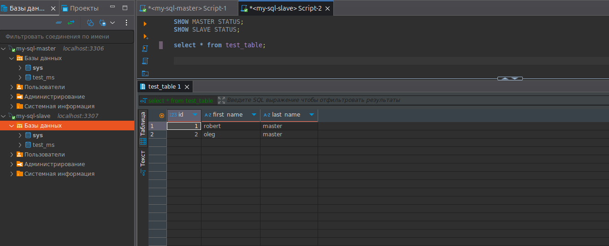